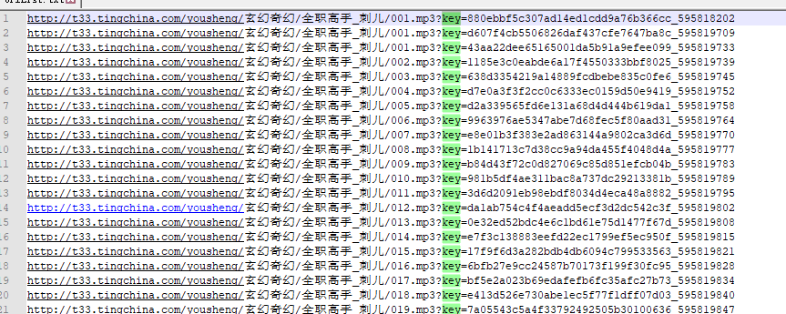

# 听中国下载

抓取`tingchina.com`音频链接后立即调用IDM下载音频。

说明：

抓取的链接为动态链接(`key`值一直在变)，所以无法提取链接后统一下载，只能抓取一个后立即下载。尝试过调用`aria2`、`wget` 都不支持此种链接形式。测试到IDM后可以完成。




附，IDM指令：

`idman /d URL [/p 本地_路径][/f 本地_文件_名] [/q][/h] [/n][/a]`

参数：

`/d URL` - 下载一个文件；

`/s `- 开始任务调度里的队列；

`/p 本地_路径` - 定义要保存的文件放在哪个本地路径；

`/f `本地local_文件_名 - 定义要保存的文件到本地的文件名；

`/q `- IDM 将在成功下载之后退出。这个参数只为第一个副本工作；

`/h` - IDM 将在成功下载之后挂起您的连接；

`/n `- 当不要 IDM 询问任何问题时启用安静模式；

`/a` - 添加一个指定的文件 用 /d 到下载队列，但是不要开始下载。


例：

```python
from subprocess import call

IDM = r'C:\Program Files (x86)\Internet Download Manager\IDMan.exe'
DownUrl = r'https://secure-appldnld.apple.com/itunes12/091-76333-20180329-6D5B026C-32F7-11E8-A675-99BAB071F5CF/iTunes64Setup.exe'
DownPath = r'E:\'
OutPutFileName = 'test.exe'
call([IDM, '/d',DownUrl, '/p',DownPath, '/f', OutPutFileName, '/n', '/a'])

```

